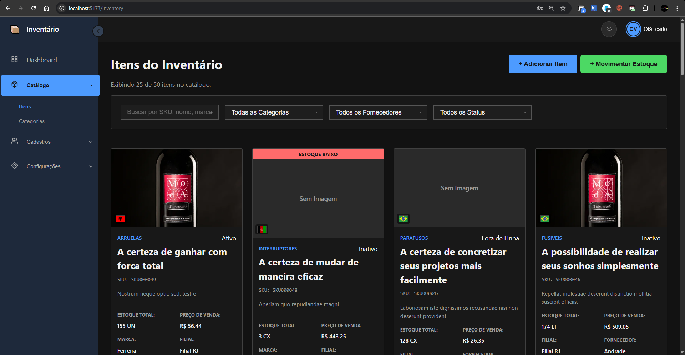

<p align="center">
  
  
  
  
  
  
  
  
</p>

<h1 align="center">Sistema de Gestão de Inventário Full-Stack</h1>


<p align="center">
  
</p>
  

## 📖 Sobre o Projeto

Este é um sistema de gestão de inventário completo, construído com uma arquitetura moderna full-stack. O backend, desenvolvido em **Django** e **Django REST Framework**, oferece uma API robusta e segura para controle transacional de estoque. O frontend, construído com **React** e **Vite**, proporciona uma interface de usuário reativa, interativa e rica em funcionalidades para uma gestão eficiente.

O projeto foi arquitetado com foco em reusabilidade, escalabilidade e manutenibilidade, utilizando padrões de design avançados como hooks customizados, componentes genéricos e uma clara separação de responsabilidades.

---

## ✨ Principais Funcionalidades

* **Backend Robusto e Testado:** API completa com uma suíte de testes abrangente que garante a integridade das regras de negócio.
* **Controle de Estoque Transacional:** Toda alteração de saldo é registrada através de um modelo `StockMovement`, garantindo uma trilha de auditoria completa.
* Modelo Avançado de Tipos de Movimento (TPO): O coração da lógica de negócio, permitindo a criação de operações de estoque (Entrada, Saída, Ajuste) com regras customizáveis como fator de multiplicação, unidades por pacote, necessidade de aprovação e impacto financeiro.
* **Arquitetura Multi-Filial:** O sistema é projetado para suportar múltiplas filiais, com permissões de usuário vinculadas a elas.
* **CRUD Completo:** Interfaces de gerenciamento completas para todas as entidades do sistema: Itens, Fornecedores, Locações, Categorias, Grupos, Filiais, Setores e Tipos de Movimento.
* **DataTable Interativa:** Um componente de tabela de dados avançado com:
    * Ordenação de colunas no lado do cliente.
    * Reordenação de colunas com drag-and-drop.
    * Seletor de visibilidade de colunas.
    * Persistência do estado (ordem e visibilidade) no `localStorage` por usuário.
* **Componentes de Formulário Inteligentes:**
    * Seletor de País (`CountrySelect`) com busca, bandeiras e uma API dedicada.
    * Campo de CNPJ com máscara e formatação automática.
* **UI Moderna e Reativa:**
    * Navegação hierárquica com menus expansíveis na `Sidebar`.
    * Interfaces com abas para gerenciamento de entidades relacionadas (Categorias/Grupos, Filiais/Setores).
    * Temas Claro e Escuro (`ThemeToggle`).

---

## 🛠️ Tech Stack

**Backend:**
* Python
* Django & Django REST Framework
* django-solo, django-countries, django-simple-history

**Frontend:**
* React
* Vite
* React Router
* Axios
* React Icons & React Country Flag
* @dnd-kit (para Drag and Drop)
* CSS Modules

---

## 🚀 Começando

Para executar o projeto localmente, siga os passos abaixo.

### Pré-requisitos

* Python (versão 3.10+)
* Node.js e npm (versão 18+)

### Instalação do Backend

1.  Navegue até a pasta do backend:
    ```bash
    cd backend
    ```
2.  Crie e ative um ambiente virtual:
    ```bash
    python -m venv .venv
    source .venv/bin/activate  # No Windows: .venv\Scripts\activate
    ```
3.  Instale as dependências:
    ```bash
    pip install -r requirements.txt
    ```
4.  Execute as migrações do banco de dados:
    ```bash
    python manage.py migrate
    ```
5.  Crie um superusuário para acessar o Django Admin:
    ```bash
    python manage.py createsuperuser
    ```
6.  Inicie o servidor de desenvolvimento:
    ```bash
    python manage.py runserver
    ```
    O backend estará rodando em `http://127.0.0.1:8000`.

### Instalação do Frontend

1.  Em um novo terminal, navegue até a pasta do frontend:
    ```bash
    cd frontend
    ```
2.  Instale as dependências:
    ```bash
    npm install
    ```
3.  Crie um arquivo de ambiente na raiz da pasta `frontend`:
    ```
    touch .env
    ```
4.  Adicione a URL da sua API ao arquivo `.env`:
    ```
    VITE_API_URL=[http://127.0.0.1:8000](http://127.0.0.1:8000)
    ```
5.  Inicie o servidor de desenvolvimento do Vite:
    ```bash
    npm run dev
    ```
    A aplicação frontend estará acessível em `http://localhost:5173`.

---

## 🗺️ Roteiro do Projeto (Backlog)

Este é o backlog atual de funcionalidades e melhorias planejadas para versões futuras.

#### **Épico: Inteligência de Negócios e Relatórios**
* Gráficos interativos no Dashboard.
* Módulo de Relatórios com exportação para CSV/Excel.
* Expandir Histórico de Alterações (`django-simple-history`) para `Item` e `Supplier`.

#### **Épico: Funcionalidades Avançadas de Logística**
* Rastreamento por Lote (Batch Tracking) com lógica FIFO/FEFO.
* Implementar Fluxo de Aprovação para Movimentos de Estoque.

#### **Épico: Ferramentas de Produtividade e Gerenciamento em Massa**
* Implementar Importação de Itens em Massa via Planilha.

#### **Épico: Melhorias de Arquitetura e Dívida Técnica**
* Refatorar para um Modelo Unificado de Parceiro de Negócios (Cliente/Fornecedor).
* Preenchimento Automático de Auditoria (`created_by`, etc.) na API.
* Garantir Imutabilidade de `StockMovement` no Django Admin.
* Refatorar Lógica de Negócio de Estoque para a Camada de Serviço (`services.py`).
* Reimplementar Relação de Gerente (`manager`) na Filial (`Branch`).
* Migração para TypeScript.
* Integrações (NFe, API de CEP).
* Autenticação com Refresh Tokens.
* Integração End-to-End para auditoria

#### **Épico: Melhorias de UI/UX**
* Pesquisa Global na aplicação.
* Refatorar Seletor de Colunas da `DataTable` para Componente Dedicado e retrátil.
* Exibir ID do Registro nos Modais de Edição para suporte.
* Corrigir e Estabilizar a Função de Destaque (Highlight) de Novas Linhas.

